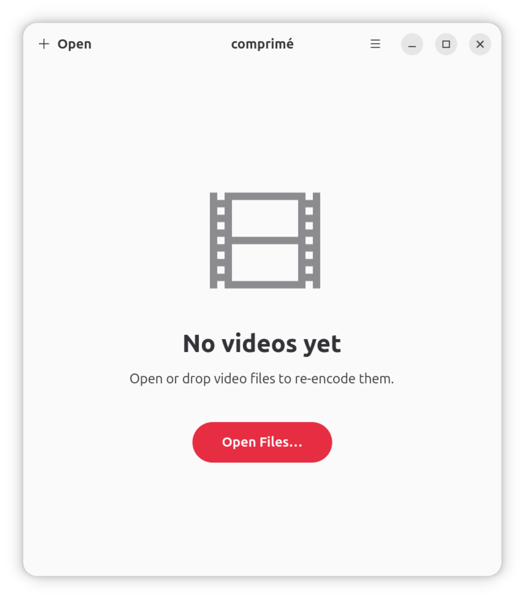
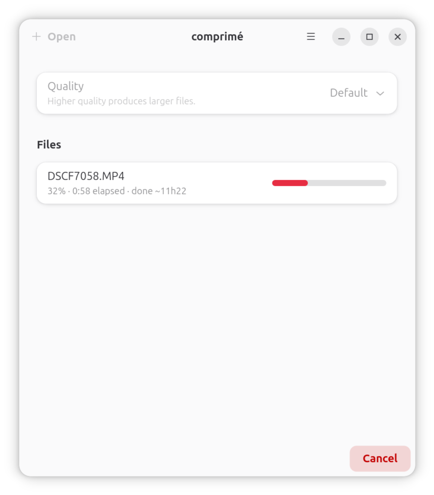

<p align="center">
  
</p>

<h1 align="center">comprimé</h1>

> \kɔ̃.pʁi.me\ French
> 1. (medicine) pill, tablet
> 2. compressed

**comprimé** compresses (re-encodes) video files using `ffmpeg`. Open one or several
videos at once, choose a quality level, and comprimé writes a re-encoded copy next to
each original (`movie.mp4` becomes `movie_reencoded.mp4`).

It is a GNOME / Adwaita application written in Vala and distributed as a Flatpak.

## Screenshots

<p align="center">
  
  &nbsp;
  
</p>

## Encoding

Every re-encode uses H.264 video and AAC audio in an MP4 container with the following
base parameters:

```
-c:v libx264 -profile:v high -level 4.0 -preset slow -crf 20 \
-pix_fmt yuv420p -c:a aac -b:a 192k -ar 48000 -ac 2 -movflags +faststart
```

The quality setting overrides the video and audio bitrate. **Default** keeps the
constant-quality (`-crf 20`) encoding above; the other levels switch the video stream
to a target bitrate:

| Level             | Video (`-b:v`) | Audio (`-b:a`) |
|-------------------|----------------|----------------|
| Default           | — (`-crf 20`)  | 192k           |
| High quality      | 8M             | 256k           |
| Medium quality    | 4M             | 192k           |
| Low quality       | 2M             | 128k           |
| Extra low quality | 1M             | 96k            |

## Installation

Once published, comprimé installs from its Flatpak bundle:

```sh
flatpak install fr.benjaminbellamy.comprime
```

(The published Flathub / GitHub release is not available yet.)

## Building

### Flatpak (recommended)

Requires `flatpak` and `flatpak-builder`, plus the GNOME 49 Platform and SDK:

```sh
flatpak install flathub org.gnome.Platform//49 org.gnome.Sdk//49

flatpak-builder --user --install --force-clean \
  flatpak-build build-aux/fr.benjaminbellamy.comprime.json

flatpak run fr.benjaminbellamy.comprime
```

The manifest builds x264 and ffmpeg (with libx264) from source, so the first build
takes a while.

### Local build with Meson

For development you can build against your system GTK 4, libadwaita and ffmpeg:

```sh
meson setup build
ninja -C build
./build/src/comprime
```

Requires `valac`, `meson`, `ninja`, GTK 4 (≥ 4.16), libadwaita (≥ 1.6) and `ffmpeg`
available on `PATH`.

## License

comprimé is released under the [GPL-3.0-or-later](LICENSE).
